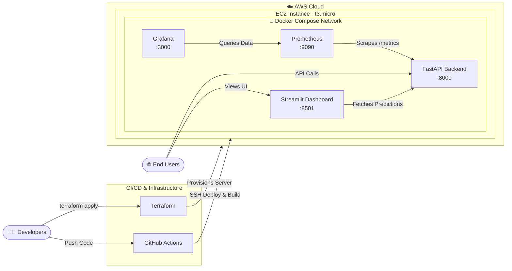

# ☀️ SolarCast v2.0 – Complete Regional Solar Power Forecasting System

> **A Production-Ready Machine Learning & DevOps Project**  
> SolarCast predicts hourly solar power generation for North, South, East, and West regions using ERA5 reanalysis weather data. It is deployed as a fully containerized microservices stack on AWS EC2, managed via Terraform, and automatically deployed using GitHub Actions CI/CD.

---

## 📋 Table of Contents
1. [Overview & Architecture](#-overview--architecture)
2. [Services Explanation](#-services-explanation)
3. [Code & Directory Structure](#-code--directory-structure)
4. [Step-by-Step Installation & Setup (Local)](#-step-by-step-installation--setup-local)
5. [Step-by-Step AWS Deployment (Terraform)](#-step-by-step-aws-deployment-terraform)
6. [CI/CD Workflow Explanation](#-cicd-workflow-explanation)
7. [API Usage & Prediction](#-api-usage--prediction)
8. [Machine Learning Details](#-machine-learning-details)

---

## 🏗️ Overview & Architecture

**SolarCast v2.0** brings together Machine Learning, Backend Engineering, Frontend Dashboards, and DevOps best practices into a single, cohesive architecture.

### Architecture Diagram



### Architecture Workflow
1. **Infrastructure as Code (IaC):** The entire AWS infrastructure is provisioned using **Terraform**. Terraform spins up a `t3.micro` EC2 instance, configures an AWS Security Group (opening ports for the API, Dashboard, and Monitoring), and generates an SSH key for access.
2. **CI/CD Pipeline:** Developers push code to the `main` branch on GitHub. A **GitHub Actions** workflow triggers automatically.
3. **Automated Deployment:** The GitHub Action securely connects to the AWS EC2 instance via SSH, pulls the latest code from the repository, and executes `docker compose up -d --build`.
4. **Microservices (Docker):** The EC2 instance runs four isolated Docker containers natively on a single virtual network.
5. **End-User Access:** Users access the Streamlit Dashboard or FastAPI Swagger UI directly via the EC2 Public IP over the internet.

---

## 🛠️ Services Explanation

The application stack consists of five major components working seamlessly together. Here is an elaborated breakdown of what each service does and how it runs:

### 1. AWS EC2 (Elastic Compute Cloud) - The Host Machine
- **What it does:** EC2 is the backbone server (virtual machine) hosted in the AWS Cloud. Instead of relying on serverless platforms, we rent a dedicated `t3.micro` Linux instance (Ubuntu) that stays online 24/7.
- **How it runs:** Provisioned dynamically by Terraform. It acts as the single entry point for our users and developers.
- **Purpose:** It provides the CPU, Memory (RAM), and network bandwidth required to run the Docker daemon. It holds our source code, downloaded via GitHub Actions, and runs the entire `docker-compose` network.

### 2. FastAPI (Backend - Port 8000)
- **What it does:** The core intelligence engine of the application. 
- **How it runs:** Runs inside a lightweight Python Docker container. It loads our pre-trained Machine Learning model (`RandomForestRegressor`) into memory at startup.
- **Purpose:** It exposes HTTP REST endpoints (`/predict` and `/health`). It intercepts incoming API calls containing live weather data, strictly validates the payload using Pydantic, passes the data through the ML inference pipeline, and returns the predicted solar power output in JSON format.

### 3. Streamlit (Frontend Dashboard - Port 8501)
- **What it does:** An interactive, visually appealing frontend web application built entirely in Python.
- **How it runs:** Runs in its own Docker container and communicates with the FastAPI container internally over the Docker network.
- **Purpose:** It gives non-technical users a way to interact with the ML model. Users can adjust sliders for Temperature, Wind Speed, and Radiation, and the dashboard instantly asks FastAPI for a prediction. It also renders rich, interactive Plotly charts showcasing historical weather trends and feature importance.

### 4. Prometheus (Time-Series Metrics Collector - Port 9090)
- **What it does:** A specialized database designed specifically for monitoring the health and performance of the application.
- **How it runs:** A standalone Docker container configured to periodically "scrape" data from FastAPI. 
- **Purpose:** FastAPI exposes a special hidden endpoint (`/metrics`). Every few seconds, Prometheus connects to this endpoint and records detailed statistics:
  - How many API requests were made?
  - How long did the Machine Learning model take to predict the result? (Prediction Latency)
  - Did the API throw any 500 Server Errors?
  - How much CPU and memory is the container using?
  - What was the actual numerical power output predicted?

### 5. Grafana (Observability Dashboard - Port 3000)
- **What it does:** A highly customizable, professional data visualization platform.
- **How it runs:** A Docker container that connects directly to the Prometheus database as its data source.
- **Purpose:** While Prometheus *collects* the data, Grafana *displays* it. Developers log into Grafana to create beautiful, real-time observability dashboards. By writing "PromQL" (Prometheus Query Language) in Grafana, you can build live charts showing:
  - **Traffic Spikes:** A graph showing HTTP requests per minute.
  - **Performance Degradation:** A gauge showing if ML prediction times exceed 500ms.
  - **Business Metrics:** A live ticker showing the total amount of Solar Power predicted today.
  - Alerts can be configured here to send a Slack or Email notification if the API goes down.

---

## 🗂️ Code & Directory Structure

Here is a clear breakdown of what every major file and folder in this project does:

```text
solarcast/
├── app/                        # FastAPI Backend Code
│   ├── api.py                  # Defines API routes, Prometheus metrics, and FastAPI initialization.
│   ├── schemas.py              # Pydantic models for strict data validation (inputs/outputs).
│   └── utils.py                # Helper functions for data preprocessing and running ML inference.
│
├── dashboard/                  # Streamlit Frontend Code
│   └── dashboard.py            # The multi-tab UI code for visualizing predictions and data.
│
├── data/                       # Datasets
│   └── unified_solar_dataset.csv # The final merged ERA5 weather dataset used for ML training.
│
├── model/                      # Serialized ML Artifacts
│   ├── solar_model.pkl         # The trained RandomForestRegressor model.
│   ├── scaler.pkl              # StandardScaler used to normalize input features.
│   └── encoder.pkl             # LabelEncoder used to convert text regions (North, South) to integers.
│
├── notebooks/                  # Data Science Scripts
│   ├── build_dataset.py        # Script to merge 4 regional datasets into the unified CSV.
│   └── train_regional_model.py # Script that trains the RandomForest model and saves the .pkl files.
│
├── infra/terraform/            # Infrastructure as Code (AWS)
│   ├── main.tf                 # Provisions the EC2 instance, Security Group, and SSH Key Pair.
│   ├── variables.tf            # Defines configurable variables (instance type, region, etc.).
│   └── outputs.tf              # Outputs the final Public IP address of the EC2 instance.
│
├── .github/workflows/          # CI/CD Pipelines
│   └── aws_deploy.yml          # GitHub Actions script for SSH deployment to EC2.
│
├── docker-compose.yml          # Connects FastAPI, Streamlit, Prometheus, and Grafana.
├── Dockerfile                  # Defines the OS and dependencies required to build the Python image.
├── prometheus.yml              # Configures Prometheus to scrape FastAPI on port 8000.
└── requirements.txt            # Python dependencies (fastapi, pandas, scikit-learn, etc.).
```

---

## 💻 Step-by-Step Installation & Setup (Local)

If you want to run the project on your local machine for development, follow these steps:

### 1. Prerequisites
- Install **Python 3.9+**
- Install **Docker Desktop** (Make sure the Docker daemon is running)
- Install **Git**

### 2. Clone the Repository
```bash
git clone https://github.com/YOUR_USERNAME/solarcast.git
cd solarcast
```

### 3. Local Python Setup (Optional - For Training)
If you want to retrain the model or test the Python code locally without Docker:
```bash
# Create a virtual environment
python -m venv venv

# Activate it (Windows)
venv\Scripts\activate

# Install dependencies
pip install -r requirements.txt

# Retrain the model
python notebooks/train_regional_model.py
```

### 4. Run the Full Stack via Docker
This is the recommended way to run the app locally. It spins up the entire production stack on your machine.
```bash
docker-compose up -d --build
```

### 5. Access the Local Services
- **FastAPI UI:** `http://localhost:8000/docs`
- **Streamlit App:** `http://localhost:8501`
- **Prometheus:** `http://localhost:9090`
- **Grafana:** `http://localhost:3000`

---

## ☁️ Step-by-Step AWS Deployment (Terraform)

This project uses Terraform to automatically build the AWS infrastructure. Follow these steps to deploy to the cloud.

### 1. Prerequisites
- Install the **AWS CLI** and configure it with your credentials (`aws configure`).
- Install **Terraform**.

### 2. Generate an SSH Key
Terraform needs an SSH key to attach to your EC2 instance so GitHub Actions can log into it.
```bash
# Run this inside the project root folder
ssh-keygen -t rsa -b 4096 -f infra/ssh_key -q -N ""
```
This generates `infra/ssh_key` (Private Key) and `infra/ssh_key.pub` (Public Key).

### 3. Configure Terraform Variables
Create a file named `infra/terraform/terraform.tfvars` and add your public key:
```hcl
aws_region    = "us-east-1"
project_name  = "solarcast"
environment   = "production"
instance_type = "t3.micro"
public_key    = "YOUR_PUBLIC_KEY_CONTENT_FROM_infra/ssh_key.pub"
```

### 4. Deploy the Infrastructure
```bash
cd infra/terraform
terraform init
terraform apply -auto-approve
```
When this finishes, Terraform will output your `ec2_public_ip`. **Save this IP address.**

---

## 🔄 CI/CD Workflow Explanation

The project uses GitHub Actions to automate deployments. You never have to manually copy files to the server.

### How it works:
1. The workflow (`aws_deploy.yml`) listens for any `git push` to the `main` branch.
2. When triggered, a temporary GitHub runner starts up.
3. It uses the `appleboy/ssh-action` to open an SSH connection to your new EC2 instance using the Private Key and Public IP.
4. On the EC2 server, it runs `git pull` to download your latest code changes.
5. It runs `docker compose up -d --build` to safely rebuild and restart the containers with zero downtime.

### How to set it up:
Go to your GitHub Repository -> **Settings** -> **Secrets and variables** -> **Actions**.
Add the following two repository secrets:
1. `EC2_HOST`: The Public IP address Terraform generated (e.g., `3.82.128.60`).
2. `EC2_SSH_KEY`: The entire contents of your private key file (`infra/ssh_key`), including the `-----BEGIN` and `END-----` lines.

Now, simply commit and push your code:
```bash
git add .
git commit -m "Deploying to AWS"
git push origin main
```
The pipeline will handle the rest!

---

## 🌐 API Usage & Prediction

The FastAPI backend is fully documented via Swagger UI. You can test it in your browser at `http://YOUR_EC2_IP:8000/docs`, or use `cURL` or `Python` to send API requests.

### Example API Request (POST /predict)
```bash
curl -X POST http://YOUR_EC2_IP:8000/predict \
  -H "Content-Type: application/json" \
  -d '{
    "region": "North",
    "temperature": 28.5,
    "pressure": 1010.2,
    "precipitation": 0.0,
    "radiation": 650.0,
    "wind_speed": 3.5,
    "hour": 12,
    "month": 6
  }'
```

### Example API Response
```json
{
  "region": "North",
  "predicted_solar_power_kw": 5.2341,
  "model_version": "2.0.0",
  "status": "success",
  "message": "Prediction completed successfully"
}
```

---

## 🤖 Machine Learning Details

The AI model at the heart of SolarCast is a **Random Forest Regressor** trained on historical ERA5 climate data.

### Features (Inputs)
- **temperature**: 2m air temperature (°C)
- **pressure**: Surface pressure (hPa)
- **precipitation**: Total precipitation (mm)
- **radiation**: Solar radiation downward (W/m²)
- **wind_speed**: Wind speed (m/s)
- **hour_sin / hour_cos**: Cyclic time encoding to help the model understand time of day.
- **month_sin / month_cos**: Cyclic month encoding to help the model understand seasons.
- **region_encoded**: Categorical encoding representing the 4 Indian regions (North, South, East, West).

### Performance Metrics
- **Algorithm**: RandomForestRegressor
- **Data Size**: ~70,000 hourly rows
- **Mean Absolute Error (MAE)**: ~0.065 kW
- **Root Mean Squared Error (RMSE)**: ~0.132 kW
- **R² Score**: ~0.997 (High accuracy due to strong correlation between solar radiation and power output).
